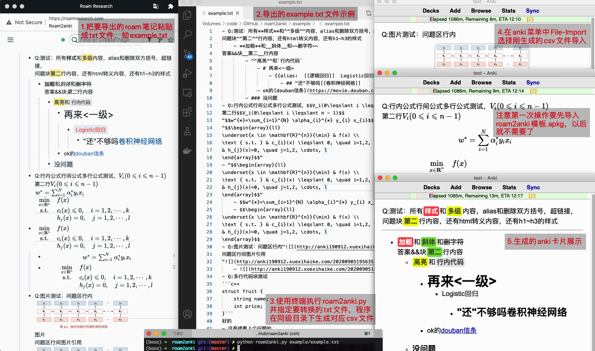

# roam2anki
roam2anki用来把Roam Research的笔记转成anki进行记忆

# 介绍
已经完成所有规划的功能，已支持roam中的所有样式，包括行内、行间公式、代码块、高亮、加粗、图片、超链接等等，其中第一级会解析为问题，第二级和往后级别均解析为第一级的答案

# 用法
1. 下载roam2anki.py和roam2anki模板.apkg
2. 第一次操作先在anki中导入roam2anki模板.apkg
3. 新建一个txt文件如example.txt，把要导入的roam字段粘贴到文本中，注意第一级为问题，第二级以下都是答案
4. 运行python脚本`python roam2anki.py example.txt`，程序把转换成对应的只有两列的csv文件，问题是第一列，回答是第二列
5. 把csv导入到anki中，保持默认设置即可。即fields separated by: Tab；勾选上Allow HTML in fields；Field 1为正面；field 2为背面

# 功能列表
* [x] 支持所有样式：加粗、斜体、高亮、删字符、行内代码、超链接
* [x] 支持图片并居中，支持引用图片
* [x] 支持答案里最高10级的缩进
* [x] 问题和答案支持块内多行
* [x] 删除alias和双中括号
* [x] 把同级问题合并成anki同一个问题
* [x] 支持问题和答案的行内公式
* [x] 支持多行行间公式，同时支持块内的新起的多行行间公式，但要注意新起一行，不能续着写
* [x] 支持代码块导入和语法高亮
* [x] 支持标题字号h1到h3
* [x] 涉及到html的<、>、&、"等字符放到anki前进行转义，保证所有字符都能显示

# 限制
- 答案和问题的代码块必须要新起一个块或块内新起一行，且这一行必须以3个反引号开始，即不支持代码块放在一行中间，原因是难以解析，且代码块展示就是会新起一行，就人工新起一行吧，结尾也要新起一行
- 只支持无序列表(Bulleted List)，不支持有序列表(Numbered List)和文档(Document)，原因是有序列表难以判断和解析，支持文档模式会和现有的块内多行的判断有歧义

# 其它说明
- roam2anki.py提供了批量转换的方法，第二个选项`python roam2anki.py example ...`，若example为一个文件夹，会寻找example下的所有以.txt结尾的文件进行转换，后续可接多个文件或文件夹
- roam2anki只支持语法正确时的解析，即保证在roam中能正确解析的，导出anki后也正确解析，不正确的语法，或故意为难解析器的，，我也没办法哇
- roam2anki目前是作者写给自用，若使用过程中发现有解析出来的bug，请提一个issue

# 依赖
- python >= 3.7
- pandas >= 1.0.1